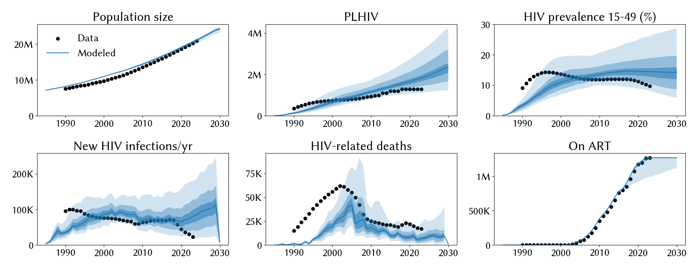
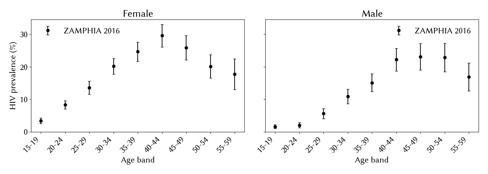

# Experiment 01 — baseline (2026-09-23)

**Commit (of the calibration itself):** `625cd89` (project scaffolding + calibration modernization + first fit iteration).
**Commit (of this retrospective run.py + SUMMARY):** `5682f3f`.
**Date run:** 2026-09-23
**Trials / workers:** 1000 / 50
**Ensemble size after shrink:** 500 draws
**Sustainability:** 0/500 extinct at 2030

## `calib_pars`

```python
{
    'hiv.beta_m2f':                 dict(low=0.008, high=0.02, guess=0.012),
    'structuredsexual.prop_f0':     dict(low=0.55,  high=0.9,  guess=0.85),
    'structuredsexual.prop_m0':     dict(low=0.50,  high=0.9,  guess=0.81),
    'structuredsexual.f1_conc':     dict(low=0.01,  high=0.2,  guess=0.01),
    'structuredsexual.m1_conc':     dict(low=0.01,  high=0.2,  guess=0.01),
    'structuredsexual.p_pair_form': dict(low=0.4,   high=0.9,  guess=0.5),
}
```

## Posterior parameters (mean, 5–95%)

| Parameter | Mean | 5% | 95% |
|---|---|---|---|
| hiv.beta_m2f | 0.014 | 0.010 | 0.015 |
| structuredsexual.prop_f0 | 0.804 | 0.754 | 0.860 |
| structuredsexual.prop_m0 | 0.862 | 0.813 | 0.898 |
| structuredsexual.f1_conc | 0.048 | 0.014 | 0.139 |
| structuredsexual.m1_conc | 0.099 | 0.017 | 0.193 |
| structuredsexual.p_pair_form | 0.489 | 0.419 | 0.569 |

## Fit at 2023

| Metric | Data | Sim median | 5–95% |
|---|---|---|---|
| Population | 20.3 M | 20.6 M | 20.2 – 20.9 M ✓ |
| PLHIV | 1.30 M | 1.83 M | 1.29 – 2.73 M (overshoots) |
| New infections/yr | 23 k | 81 k | 33 – 148 k (3× too high) |
| HIV deaths/yr | 17 k | 6.8 k | 2 – 15 k (2× too low) |
| On ART | 1.27 M | 1.27 M | 1.12 – 1.27 M ✓ |
| Prev 15–49 | 9.8% | 14.5% | 9.4 – 21.8% (overshoots) |

## What we learned

- `structuredsexual.prop_m0` hit its upper prior bound (0.9) in 342/500 top
  draws — the calibration wants more low-risk-fraction males to bring
  transmission down and the prior is blocking it.
- HIV deaths undershoot 2×; population and ART cascade are clean.
- Structural transmission-too-high signature persists even after
  `dedup_deaths` — dedup fixed the mortality double-count but did not
  resolve the incidence/prevalence overshoot.

## Next-step candidate

- Add `hiv.rel_death` to the search space so mortality can be pulled up
  independently.
- Widen `structuredsexual.prop_m0` upper bound to 0.98 so the sampler can
  express the low-risk-fraction preference the current prior is clipping.
- → carried forward into `02_open_rel_death_widen_prop_m0`.

## Figures





The ZAMPHIA plot has no model overlay in this experiment: `extra_results`
did not carry age × sex prevalence. Added in exp 02.
