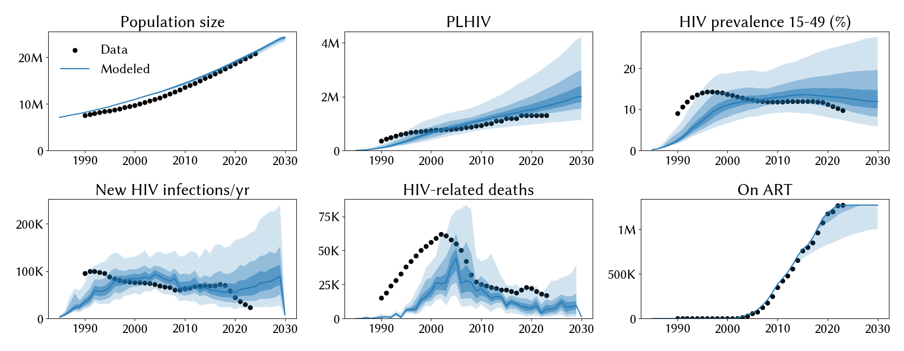
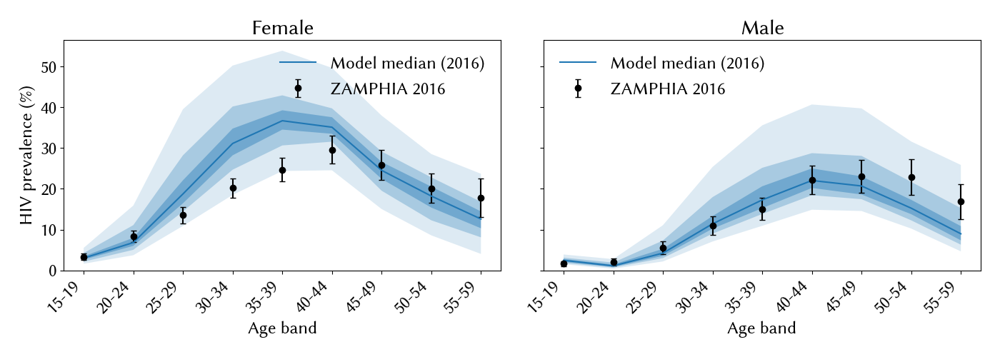

# Experiment 02 — open `hiv.rel_death`, widen `prop_m0` upper bound

**Date run:** 2026-09-24.
**Commit:** `6abbf75` (this experiment's `run.py` + scaffold).
**Trials / workers:** 1000 / 50. **Ensemble size after shrink:** 500 draws.
**Sustainability:** 0/500 extinct at 2030 (min prev 15-49 = 5.1% at 2030).
**Mismatch:** min=23.83, mean=28.36, max=30.47.

## Question

Following exp 01 (`../01_baseline_2026-09-23/SUMMARY.md`), HIV deaths
undershot 2× and `structuredsexual.prop_m0` pegged its 0.9 upper prior
bound in 342/500 top draws. Does opening `hiv.rel_death` fix the death
undershoot, and does widening `prop_m0` to 0.98 reveal a stable
posterior or continued pegging?

## Result

Partial improvement, ceiling not resolved. PLHIV overshoot came down
from 1.83M → 1.65M and prev 15-49 from 14.5% → 12.8%, but **HIV deaths
stayed at 6.8k/yr** (data: 17k) despite `hiv.rel_death` posterior mean
pushing to 1.41 (5–95%: 1.06–1.53) near its 1.6 upper prior. And
`prop_m0` **still pegs at the widened upper** — mean 0.955, 5–95%:
0.92–0.98. Age × sex diagnostic reveals the underlying structural gap:
**model overshoots female prevalence at ages 25–49** but matches male
prevalence cleanly across all bands.

## Fit at 2023 (median, 10–90%)

| Metric | Data | Exp 01 median | Exp 02 median | Direction |
|---|---|---|---|---|
| Population | 20.3 M | 20.6 M | 20.6 M | ✓ unchanged |
| PLHIV | 1.30 M | 1.83 M | 1.65 M [1.36 – 2.28] | improved but still overshoots |
| New infections/yr | 23 k | 81 k | 65 k [37 – 120] | 3.5× → 2.8× |
| HIV deaths/yr | 17 k | 6.8 k | 6.8 k [2.7 – 14] | unchanged, still 2× low |
| On ART | 1.27 M | 1.27 M | 1.27 M | ✓ unchanged |
| Prev 15–49 | 9.8 % | 14.5 % | 12.8 % [10.1 – 18.9] | improved but still overshoots |

## Posterior parameters (mean, 5–95%)

| Parameter | Prior | Mean | 5% | 95% | Note |
|---|---|---|---|---|---|
| `hiv.beta_m2f` | [0.008, 0.02] | 0.0105 | 0.0092 | 0.0117 | interior |
| `hiv.rel_death` | [0.6, 1.6] | 1.407 | 1.064 | 1.526 | pushed toward upper |
| `structuredsexual.prop_f0` | [0.55, 0.9] | 0.781 | 0.754 | 0.808 | interior |
| `structuredsexual.prop_m0` | [0.50, 0.98] | 0.955 | 0.917 | 0.980 | **still pegs upper** |
| `structuredsexual.f1_conc` | [0.01, 0.2] | 0.056 | 0.022 | 0.175 | wide |
| `structuredsexual.m1_conc` | [0.01, 0.2] | 0.078 | 0.044 | 0.104 | interior |
| `structuredsexual.p_pair_form` | [0.4, 0.9] | 0.532 | 0.487 | 0.633 | interior |

## Observations

1. **`hiv.rel_death` is not doing what we expected.** Posterior mean 1.41
   pushes near the 1.6 upper prior, but HIV deaths per year stayed
   unchanged at 6.8k. Death rate per PLHIV is essentially the same as
   exp 01 (~0.41% vs 0.37%). What `rel_death` bought us was a lower
   PLHIV pool via compensating parameter shifts, not more deaths.
2. **`prop_m0` still pegs the upper bound** even after widening 0.9 →
   0.98. Widening the prior did not resolve the pegging — this is
   structural. The model wants an extremely concentrated risk
   distribution to cool aggregate transmission, but even 98%
   low-risk-fraction males isn't enough.
3. **Age × sex diagnostic reveals a sex-asymmetric fit failure.** Male
   prevalence tracks ZAMPHIA closely across all age bands. Female
   prevalence overshoots substantially at 25-49 (model median ~35% at
   30-39 vs ZAMPHIA ~22%) and the peak shifts left (model 35-39 vs
   data 40-44). The persistent aggregate prev 15-49 overshoot is
   dominated by this female mid-life overshoot.
4. **Incidence overshoot came down but is still 2.8× data** (65k vs
   23k). This is the primary remaining problem for scenario use.
5. Ensemble mismatch is remarkably tight (23.8 – 30.5) — Optuna is
   converging on a narrow basin. Suggests the fit ceiling is
   structural, not a search-budget problem.

## Next-step candidates

- **The female-mid-life overshoot is the highest-leverage lead.** Options:
  - Open `hiv.beta_f2m` differentially (currently only `beta_m2f` is
    calibrated); the model may be enforcing symmetric bidirectional
    transmission that doesn't match Zambia's female-skewed epidemic.
  - Check `sti.HIV`'s age-mixing / partner-choice defaults — does the
    model assume symmetric age preferences?
- **Investigate why `rel_death` didn't move deaths.** Candidate hypotheses:
  age-at-death mismatch (ART scale-up prevents deaths at ages where
  the data expects them), or death events happening in a pool the
  observation code doesn't count.
- **`prop_m0` structural pegging.** Rather than widen further (99%
  low-risk-fraction is implausible), consider adding an orthogonal
  transmission-cooling knob (`sti.ART.vls_coverage` uncertainty, or a
  condom-effectiveness prior).

Not proposing all three at once. One change per experiment — likely
next is the differential female transmission or an age-mixing
investigation.
