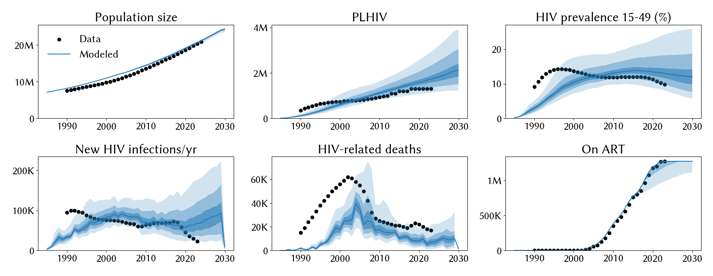
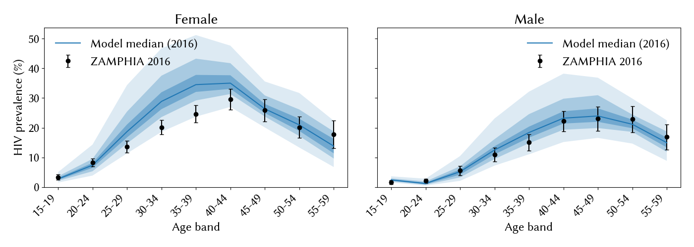

# Experiment 03 — constrain `structuredsexual.prop_m0` to biologically plausible range

**Date run:** 2026-09-24.
**Commit:** `562a22e`.
**Trials / workers:** 1000 / 50. **Ensemble size after shrink:** 500 draws.
**Sustainability:** 0/500 extinct at 2030 (min prev 15-49 = 3.5% at 2030).
**Mismatch:** min=26.08, mean=29.79, max=31.50.

## Question

Exp 02 posterior mean for `structuredsexual.prop_m0` was 0.955 (5-95%:
0.92-0.98), pegging the widened 0.98 upper bound. The researcher flags
that as biologically implausible — the low-risk share of males in
Zambia should sit around 60-80%, not 95%+. Constraining the prior to
[0.60, 0.80]: does the calibration find other knobs to cool
transmission, or does the fit collapse?

## Diff vs exp 02

- `structuredsexual.prop_m0`: `[0.50, 0.98]` → `[0.60, 0.80]`, guess
  0.81 → 0.70. All other parameters unchanged.

## Result

**Fit barely moves; `prop_m0` still pegs its upper bound; mismatch
degrades only ~2 points.** Constraining the prior forces `prop_m0`
posterior mean from 0.955 → 0.765, still pegged at the new 0.80 upper.
PLHIV, incidence, deaths, and prev 15-49 are all within 5-10% of exp 02
values. Compensating parameter shifts are mostly in directions that
should raise, not lower, transmission (higher `beta_m2f`, higher
`p_pair_form`, lower `prop_f0`) — physically ambiguous. **Female
mid-life overshoot persists unchanged.**

## Fit at 2023 (median, 10-90%)

| Metric | Data | Exp 02 | Exp 03 | Change |
|---|---|---|---|---|
| Population | 20.3 M | 20.6 M | 20.7 M [20.4 – 20.8] | ~unchanged |
| PLHIV | 1.30 M | 1.65 M | 1.72 M [1.36 – 2.32] | +4% (slightly worse) |
| New infections/yr | 23 k | 65 k | 67 k [37 – 122] | +3% (unchanged) |
| HIV deaths/yr | 17 k | 6.8 k | 6.8 k [3.4 – 12] | unchanged |
| On ART | 1.27 M | 1.27 M | 1.27 M [1.19 – 1.27] | unchanged |
| Prev 15-49 | 9.8 % | 12.8 % | 13.0 % [9.8 – 18.2] | +0.2pp (unchanged) |

## Posterior parameters (mean, 5-95%)

| Parameter | Prior | Exp 02 mean | Exp 03 mean | Note |
|---|---|---|---|---|
| `hiv.beta_m2f` | [0.008, 0.02] | 0.0105 | 0.0113 | UP (compensating) |
| `hiv.rel_death` | [0.6, 1.6] | 1.407 | 1.306 | slight drop; still high |
| `structuredsexual.prop_f0` | [0.55, 0.9] | 0.781 | 0.723 | DOWN |
| `structuredsexual.prop_m0` | **[0.60, 0.80]** | 0.955 | 0.765 | **still pegs new upper** |
| `structuredsexual.f1_conc` | [0.01, 0.2] | 0.056 | 0.081 | UP |
| `structuredsexual.m1_conc` | [0.01, 0.2] | 0.078 | 0.080 | unchanged |
| `structuredsexual.p_pair_form` | [0.4, 0.9] | 0.532 | 0.720 | UP substantially |

## Observations

1. **`prop_m0` still pegs, now at 0.80.** The model consistently wants
   "more low-risk males" regardless of the prior width. The signal is
   robust across three experiments (0.9 → 0.98 → 0.80 upper bound
   pegged in each). This is not a prior-width problem; it's the model
   using this knob as its only handle on aggregate male transmission.
2. **The fit didn't collapse — but the compensating parameter shifts
   are physically ambiguous.** `beta_m2f` and `p_pair_form` both went
   up (should raise transmission); `prop_f0` went down (more high-risk
   women, should also raise transmission). Yet aggregate fit metrics
   are ~unchanged. Optuna appears to be finding a different basin with
   similar aggregate output but different microscopic parameterisation.
3. **Female mid-life overshoot is unchanged.** The ZAMPHIA plot
   overlays are effectively identical to exp 02 — female overshoots at
   30-39 (~35% model vs ~22% data), male fit is clean. The current
   parameter set cannot express the F/M asymmetry the data requires.
4. **Ensemble mismatch is remarkably stable across the epoch.** Exp 01
   → 02 → 03 mismatch min = ?, 23.8, 26.1. All three experiments in
   the epoch plateau at mismatch ~24-31. **We are up against a
   structural fit ceiling that parameter tweaks alone won't crack.**
5. HIV deaths are stuck at 6.8k/yr across all three experiments
   despite `rel_death` posterior pushing 1.3-1.4 (near upper bounds).
   Death observation issue is orthogonal to the transmission cooling
   problem.

## Next-step candidates

The epoch's parameter-tweak budget is exhausted. Recommend a
**structural (next-epoch) change**. Ordered by expected leverage:

1. **Open `hiv.beta_f2m` differentially.** The single highest-leverage
   lead. Female mid-life overshoot is the largest residual signal and
   this parameter set cannot express F/M asymmetry.
2. **Add `sti.ART.vls_coverage` uncertainty** once the VL coverage data
   the researcher is sourcing lands. Would let ART pull transmission
   down without requiring `prop_m0` to carry the load.
3. **Investigate HIV death observation.** `rel_death` pushed 1.3-1.4
   across three experiments without moving the death count.
   Candidates: age-at-death mismatch (ART scale-up prevents deaths at
   ages the data expects them), or death events falling outside the
   observation window.

Neither (1) nor (2) is a parameter-only change — (1) requires opening a
knob that the epoch's structural setup had held fixed at symmetric
default; (2) requires new data. Both plausibly warrant a new epoch.
