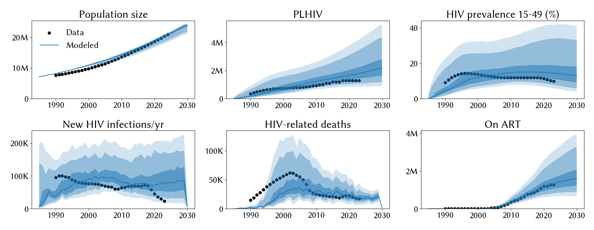
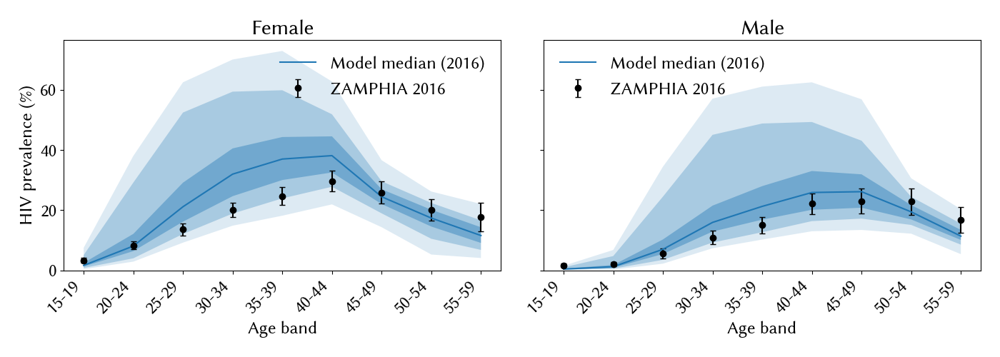

# Experiment 02.01 — epoch 02 baseline: exp 03 pars + widened beta on stratified-treatment setup

**Date run:** 2026-09-24.
**Commit:** `334d8e0`.
**Trials / workers:** 1000 / 50. **Ensemble size after shrink:** 500 draws.
**Sustainability:** 0/500 extinct at 2030 (min prev 15-49 = 3.5% at 2030).
**Mismatch:** min=22.62, mean=29.19, max=33.76.

## Question

Epoch 01 closed with three residual problems: (a) female mid-life
prevalence overshoot at ages 25-49, (b) HIV deaths stuck at 6.8k/yr
(data 17k), (c) `structuredsexual.prop_m0` pegging its upper prior.
Epoch 02 makes four structural changes without touching the epoch 01
exp 03 priors (except widening `beta_m2f` upper 0.02 → 0.2). Does the
combined treatment/condom rework move the fit? Which of the three
epoch-01 residuals resolve?

## `calib_pars`

From `../../01_post_dedup/03_prop_m0_bio_range/run.py`, with
`hiv.beta_m2f` upper widened 10× (0.02 → 0.2). See `run.py`.

## Result

**HIV deaths solved; female mid-life overshoot persists; `prop_m0`
still pegs; PLHIV/prev medians drift higher because the widened beta
opened hot-transmission regimes.** Best mismatch 22.6 (was 26.1 in
exp 03) — modest improvement in the best draw; ensemble median
degrades on aggregate metrics because Optuna favors solutions with
matching deaths + higher beta.

## Fit at 2023 (median, 10-90%)

| Metric | Data | Exp 03 (epoch 01) | Exp 02.01 (epoch 02) | Change |
|---|---|---|---|---|
| Population | 20.3 M | 20.7 M | 20.3 M [18.5 – 20.8] | ✓ on data |
| PLHIV | 1.30 M | 1.72 M | 1.80 M [1.09 – 3.46] | +5%; wider ribbons |
| New infections/yr | 23 k | 67 k | 79 k [35 – 174] | +18%; wider ribbons |
| **HIV deaths/yr** | 17 k | 6.8 k | **19 k [12 – 33]** | **on data ✓** |
| On ART | 1.27 M | 1.27 M | 1.33 M [0.82 – 2.51] | grows post-2023 now |
| Prev 15-49 | 9.8 % | 13.0 % | 14.5 % [7.8 – 33.9] | +1.5pp; wider |

## Posterior parameters (mean, 5-95%)

| Parameter | Prior | Exp 03 mean | Exp 02.01 mean | Note |
|---|---|---|---|---|
| `hiv.beta_m2f` | **[0.008, 0.20]** | 0.0113 | 0.0164 (0.0116-0.0223) | still inside old [0.008, 0.02]; widening didn't pull posterior out |
| `hiv.rel_death` | [0.6, 1.6] | 1.306 | 1.236 (0.739-1.573) | dropped; wider CI; no longer forced to upper |
| `structuredsexual.prop_f0` | [0.55, 0.9] | 0.723 | 0.766 | shifted up |
| `structuredsexual.prop_m0` | [0.60, 0.80] | 0.765 | 0.778 (0.705-0.799) | **still pegs upper** |
| `structuredsexual.f1_conc` | [0.01, 0.2] | 0.081 | 0.073 | ~stable |
| `structuredsexual.m1_conc` | [0.01, 0.2] | 0.080 | 0.103 | up |
| `structuredsexual.p_pair_form` | [0.4, 0.9] | 0.720 | 0.534 (0.457-0.755) | dropped substantially |

## Observations

1. **HIV deaths finally match.** Median 19k vs data 17k — the biggest
   epoch 01 → 02 win. Attributable to the treatment cascade rework:
   stratified ART targeting means older strata (higher CD4-progressed
   PLHIV) don't get over-treated, and stratified VLS at 85-92% (vs
   implicit 100%) means some ART-covered agents still die.
2. **`hiv.rel_death` posterior fell to 1.24 with wide CI [0.74, 1.57]** —
   no longer forced to the upper bound as it was in exp 03 (1.31). The
   parameter is now identifiable rather than compensating for a
   structural gap.
3. **Widened `beta_m2f` prior did NOT pull the posterior into higher
   territory.** Posterior 5-95% [0.0116, 0.0223] fully inside the old
   [0.008, 0.02] prior. The widening opened up hot regimes for Optuna
   to explore, contributing to the wider aggregate ribbons, but the
   posterior mass stayed near the exp 03 range. Beta is well-identified
   at ~0.011-0.017; the 10× widening was safety margin, not a
   productive expansion. Recommend narrowing back to ~[0.008, 0.025].
4. **`prop_m0` STILL pegs its upper (0.80).** Four experiments,
   consistent behavior — this is a robust structural signal that the
   parameter is doing the entire cooling work in its neighborhood.
5. **Female mid-life prevalence overshoot persists**, effectively
   unchanged (model median ~35-38% at 30-39 vs ZAMPHIA ~22-25%). The
   ART/VLS/condom rework did NOT resolve the F/M asymmetry — as
   suspected in epoch 01, that requires a differential-transmission
   parameter (`hiv.beta_f2m`) that the symmetric setup cannot express.
6. **Ensemble ribbons are much wider than exp 03** on all metrics.
   Some draws produce 3.5M PLHIV (2.7× data) — pathological hot
   fits that mostly reflect the widened beta prior.

## Next-step candidates

Ordered by expected leverage:

1. **Narrow `hiv.beta_m2f` back to ~[0.008, 0.025]** — posterior mass
   stayed inside old prior. The widening bought nothing and cost fit
   quality via hot regimes. This is a parameter-only change → same
   epoch, next experiment.
2. **Open `hiv.beta_f2m` differentially** to attack the female overshoot.
   Justified by the ZAMPHIA age × sex incidence asymmetry (F 1.16% vs
   M 0.25% at 25-34). Structural change → **next epoch** if it changes
   the model interface; parameter change (same epoch) if `beta_f2m` is
   already a `sti.HIV` par that we're just opening for calibration.
3. **Investigate why `prop_m0` still pegs post-treatment-rework.** The
   condom scale-up + growing ART should have relieved this. Persistent
   pegging suggests the structural signal isn't about aggregate cooling
   after all — could be about network structure (concentration in
   low-risk vs high-risk males) that no other parameter can express.
