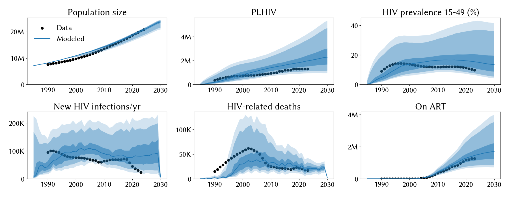
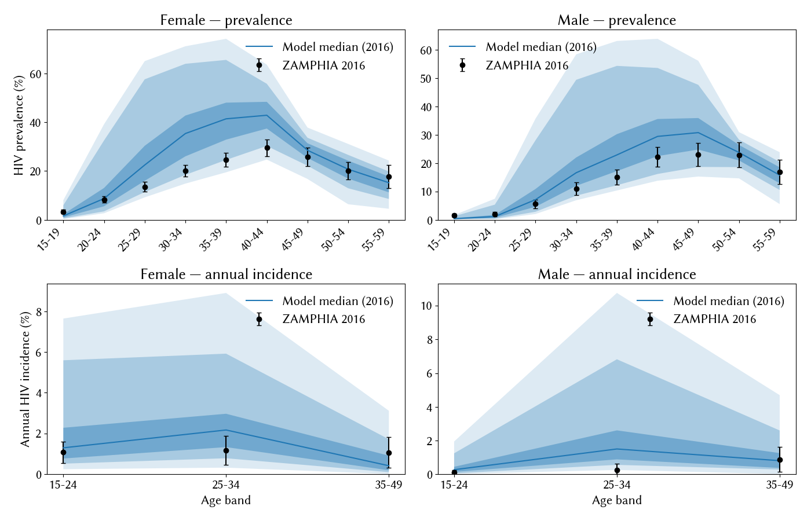

# Experiment 02.02 — re-run of exp 02.01 pars on refreshed calibration data

**Date run:** 2026-09-25.
**Commit:** `3381c58`.
**Trials / workers:** 1000 / 50. **Ensemble size after shrink:** 500 draws.
**Sustainability:** 0/500 extinct at 2030 (min prev 15-49 = 3.8% at 2030).
**Mismatch:** min=23.44, mean=30.99, max=36.07.

## Question

Two in-epoch changes since exp 02.01: (1) `data/zambia_hiv_calib.csv`
refreshed on origin (prior targets had a problem per researcher —
mostly a 2020-2023 trajectory adjustment plus truncation at 2023);
(2) extras expanded with `hiv.new_infections_{sex}_{ab1}_{ab2}` and
`hiv.n_infected_{sex}_{ab1}_{ab2}` so the ZAMPHIA incidence overlay
renders. Same `calib_pars` as 02.01. Do the same posteriors hit the
refreshed targets, and does the incidence overlay reveal the same F/M
asymmetry as prevalence?

## Result

**Fit degrades slightly across most metrics; `prop_m0` finally
relaxes off its upper bound; incidence overlay confirms the model
over-transmits across all age × sex strata by ~3-4×.** Best mismatch
23.4 (vs 22.6 in 02.01). PLHIV / prev / incidence medians drifted
higher; deaths held on data (21 k vs 17 k data). `rel_death`
posterior fell from 1.24 → 1.09 with a wider low tail — deaths
are now over-shooting mildly, giving the sampler room to relax
the death knob down.

## Fit at 2023 (median, 10-90%)

| Metric | Data | Exp 02.01 | Exp 02.02 | Change |
|---|---|---|---|---|
| Population | 20.3 M | 20.3 M | 20.2 M [18.3 – 20.8] | ~same |
| PLHIV | 1.30 M | 1.80 M | 1.97 M [1.10 – 3.74] | worse |
| New infections/yr | 23 k | 79 k | 81 k [33 – 180] | ~same |
| HIV deaths/yr | 17 k | 19 k | 21 k [12 – 33] | slightly hot |
| On ART | 1.27 M | 1.33 M | 1.45 M [0.82 – 2.72] | drifting hot |
| Prev 15-49 | 9.8 % | 14.5 % | 15.4 % [7.6 – 36.8] | worse |

## Posterior parameters (mean, 5-95%)

| Parameter | Prior | Exp 02.01 mean | Exp 02.02 mean | Note |
|---|---|---|---|---|
| `hiv.beta_m2f` | [0.008, 0.20] | 0.0164 | 0.0154 (0.0102-0.0223) | inside old [0.008, 0.02] again |
| `hiv.rel_death` | [0.6, 1.6] | 1.236 | 1.089 (0.636-1.338) | dropped; wider low tail |
| `structuredsexual.prop_f0` | [0.55, 0.9] | 0.766 | 0.707 (0.640-0.857) | dropped |
| `structuredsexual.prop_m0` | [0.60, 0.80] | 0.778 | 0.730 (0.657-0.775) | **no longer pegs upper** |
| `structuredsexual.f1_conc` | [0.01, 0.2] | 0.073 | 0.075 | ~stable |
| `structuredsexual.m1_conc` | [0.01, 0.2] | 0.103 | 0.103 | stable |
| `structuredsexual.p_pair_form` | [0.4, 0.9] | 0.534 | 0.607 (0.557-0.657) | up |

## Observations

1. **`prop_m0` finally relaxes off its upper bound** — first time in
   five experiments (was pegged in exps 02.01, 03, 02, 01 upper bounds
   of 0.90, 0.98, 0.90, 0.90). Posterior mean 0.73 with 90% CI
   0.66-0.78 sits well inside [0.60, 0.80]. Refreshed calibration
   targets appear to give the sampler enough slack that the low-risk
   fraction knob is no longer the sole cooling lever. Note that
   `p_pair_form` picked up some of that load (up 0.53 → 0.61).
2. **Model incidence overlay confirms uniform over-transmission across
   all age × sex strata** by roughly 3-4× data. Bottom-row ribbons in
   the ZAMPHIA plot cover 2-10% annual incidence vs data 0.1-1.2%.
   Not a differential-transmission failure at incidence level; the
   model's aggregate FOI is too high, and that manifests uniformly.
   The female-mid-life PREVALENCE overshoot may thus be an
   accumulation artifact of uniformly too-high incidence over decades,
   not an F/M-specific transmission bias.
3. **`rel_death` posterior fell to 1.09 with a wider low tail** —
   deaths are now mildly hot (21k vs 17k data), so the sampler is
   relaxing `rel_death` toward lower values to cool them.
4. **Widened `beta_m2f` still bought nothing.** Posterior [0.010,
   0.022] fully inside old [0.008, 0.02] prior. Recommend narrowing
   back next experiment.
5. Ensemble ribbons on aggregate fit remain wide (PLHIV 10-90%: 1.1M
   to 3.7M — includes some pathological hot draws) — same widened-beta
   artifact as 02.01.

## Next-step candidate

- **Narrow `hiv.beta_m2f` back to [0.008, 0.025]** — parameter-only
  change, in-epoch (exp 02.03). Two experiments in a row show the
  widening does nothing except open pathological hot regimes.
- **Diagnose the uniform 3-4× incidence over-transmission.** The FOI
  is too high globally. Candidates: condom effectiveness (`eff_condom`
  fixed at 0.5, could be lower/higher than needed), diagnosis-limited
  ART cascade capping at 72% coverage (holding back ART's
  transmission-cooling effect), residual network structure knobs.
