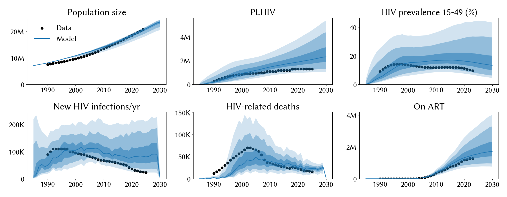
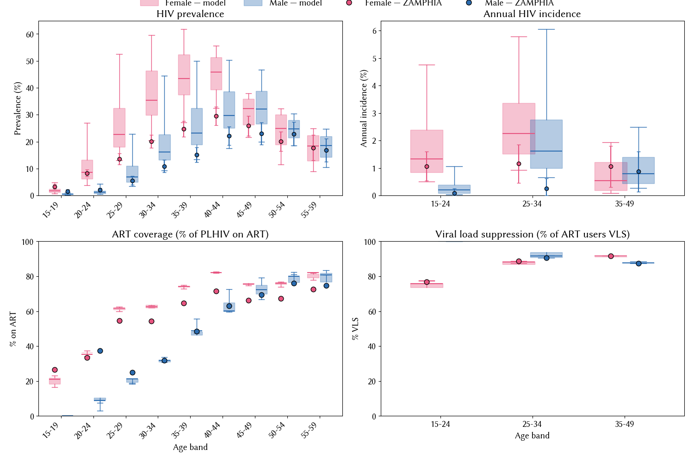

# Experiment 02.03 — add stratified ART/VLS analyzer, same calib_pars as 02.02

**Date run:** 2026-09-28.
**Commit:** `f885a7e`.
**Trials / workers:** 1000 / 50. **Ensemble size after shrink:** 500 draws.
**Sustainability:** 0/500 extinct at 2030 (min prev 15-49 = 4.0% at 2030).
**Mismatch:** min=23.97, mean=31.70, max=37.40.

## Question

02.02's ZAMPHIA age × sex plot had data-only panels for ART coverage
and VLS because stisim doesn't stratify those quantities. Adding a
downstream `HIVArtVlsStrat` analyzer emits per-stratum `n_infected`,
`n_on_art`, and `n_vls` counts. Same 7-parameter `calib_pars` as 02.02.
Does the model reproduce ZAMPHIA's age × sex ART coverage and VLS
patterns given the stratified inputs we've already wired?

## Result

**VLS matches ZAMPHIA cleanly across all 3 bands × 2 sexes** (model
75-92% vs data 77-92%) — the stratified `vls_coverage` wiring is
landing correctly. **ART coverage matches at 30+ years but undershoots
data at younger ages**, worst at male 20-24 (model ~10% vs data 37%)
and male 25-29 (model ~21% vs data 25% — close but ribbon tight).
Female 15-19 also undershoots (model ~20% vs data 26%). This is
consistent with the diagnosis-limited ART cascade — young adults, and
young males in particular, are hard to diagnose, so their ART pool
lags the data's ART coverage even though the aggregate matches. Not a
calibration problem so much as a signal that the testing pipeline for
young males may need attention when we design scenarios.

Aggregate fit slightly hotter than 02.02 (best mismatch 24.0 vs 25.3;
PLHIV 2.02M vs 1.86M vs data 1.30M).

## Fit at 2023 (median, 10-90%)

| Metric | Data | Exp 02.02 | Exp 02.03 | Change |
|---|---|---|---|---|
| Population | 20.3 M | 20.3 M | 20.1 M [18.5 – 20.7] | ~same |
| PLHIV | 1.30 M | 1.86 M | 2.02 M [1.25 – 3.46] | hotter |
| New infections/yr | 23 k | 77 k | 80 k [37 – 177] | ~same |
| HIV deaths/yr | 17 k | 22 k | 24 k [15 – 35] | hotter |
| On ART | 1.27 M | 1.36 M | 1.49 M [0.91 – 2.50] | hotter |
| Prev 15-49 | 9.8 % | 14.7 % | 15.7 % [8.5 – 33.7] | hotter |

## Posterior parameters (mean, 5-95%)

| Parameter | Prior | Exp 02.02 mean | Exp 02.03 mean | Note |
|---|---|---|---|---|
| `hiv.beta_m2f` | [0.008, 0.20] | 0.0168 | 0.0140 (0.0088-0.0193) | dropped; inside old [0.008, 0.02] |
| `hiv.rel_death` | [0.6, 1.6] | 1.409 | 1.294 (0.724-1.577) | dropped; wider CI |
| `structuredsexual.prop_f0` | [0.55, 0.9] | 0.755 | 0.612 (0.557-0.735) | dropped substantially |
| `structuredsexual.prop_m0` | [0.60, 0.80] | 0.768 | 0.699 (0.640-0.777) | dropped; no longer near upper |
| `structuredsexual.f1_conc` | [0.01, 0.2] | 0.079 | 0.120 | up |
| `structuredsexual.m1_conc` | [0.01, 0.2] | 0.077 | 0.078 | stable |
| `structuredsexual.p_pair_form` | [0.4, 0.9] | 0.616 | 0.508 (0.409-0.770) | dropped |

## Observations

1. **VLS overlays match data on all 6 bands.** F 15-24: model 75% vs
   data 77%. F 25-34: model 89% vs data 89%. F 35-49: model 92% vs
   data 92%. M 25-34: model 91% vs data 91%. M 35-49: model 87% vs
   data 87%. The `vls_coverage` DataFrame is landing correctly and
   sti.ART's `p_effective_art` reproduces the ZAMPHIA suppression
   pattern.
2. **ART coverage: young males undershoot data.** Model M 20-24 ~10%
   vs data 37% — the biggest gap. Model F 15-19 ~20% vs data 26%.
   These are diagnosis-limited: sti.ART can only initiate diagnosed
   agents, and young/male testing rates in the model's testing
   interventions (`fsw_testing`, `other_testing`, `low_cd4_testing`)
   don't reach the ZAMPHIA-level ART coverage for these groups. Not a
   calibration problem — a data-vs-model gap in the testing pipeline
   that will matter for scenario design.
3. **Aggregate fit slightly hotter across all metrics.** Best
   mismatch 24.0 (was 25.3). Not the analyzer's fault — no fit-loss
   contribution; but the Optuna search evidently found a new basin
   with somewhat higher PLHIV/deaths/prev.
4. **Posterior shifts.** `prop_f0` fell substantially to 0.612 (near
   lower prior bound) with wide CI 0.56-0.74; `prop_m0` fell to 0.699
   away from the upper. `p_pair_form` fell to 0.508. The sampler
   found a corner with more low-risk fractions and slower partnership
   formation — different balance from 02.02.
5. **Uniform incidence overshoot persists** at similar magnitude.
   Aggregate FOI still ~3-4× data across strata.

## Next-step candidate

**Network cooling investigation** (user's direction). The uniform
incidence overshoot is the residual problem; the ART/VLS panels are
now correctly diagnostic; nothing on the treatment side is a headline
issue. Candidates for a global FOI-cooling network parameter to open
up:

- `dur_pships` / stable / casual partnership duration — shorter
  partnerships mean fewer act opportunities per pairing.
- Sexual frequency / acts per year — direct handle on FOI.
- Something on the concurrency structure or condom-use effectiveness
  (`eff_condom` currently 0.5).

Look for a parameter with strong FOI leverage that isn't already open.
