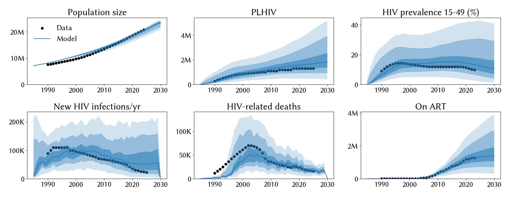
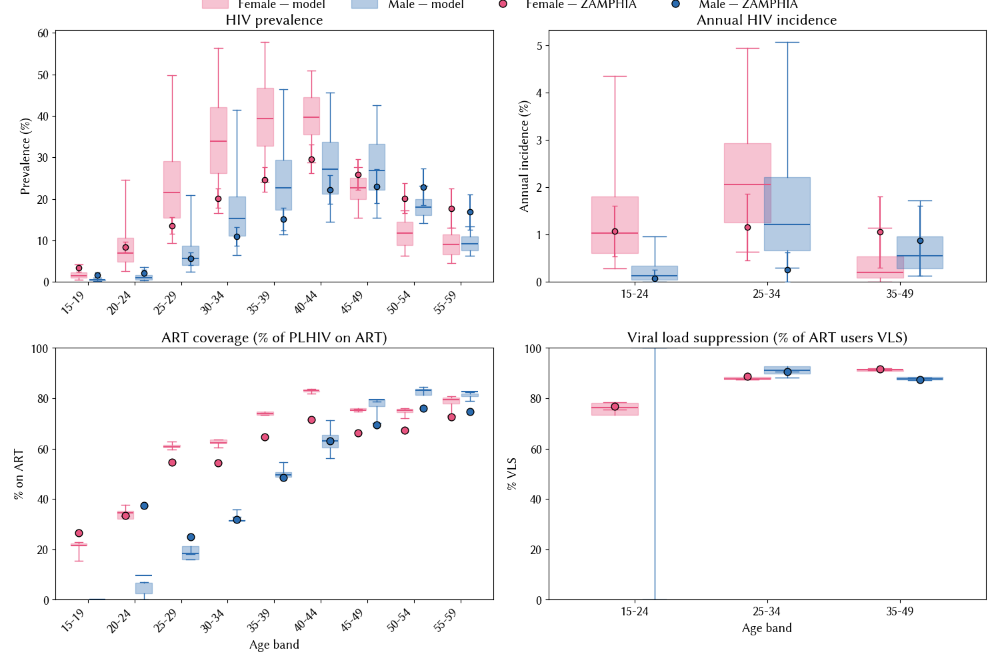

# Experiment 02.04 — open five global-FOI levers; halves mismatch

**Date run:** 2026-09-28.
**Commit:** *scaffold at ~exp 02.04 commit*.
**Trials / workers:** 1000 / 50. **Ensemble size after shrink:** 500 draws.
**Sustainability:** 0/500 extinct at 2030 (min prev 15-49 = 1.2% at 2030).
**Mismatch:** min=12.72, mean=21.98, max=30.48.

## Question

Exps 02.01-02.03 showed model over-transmits by ~3-4× uniformly across
all F/M age × sex strata; the 7-par set couldn't cool enough. This
experiment opens five new levers: high-risk fractions (`prop_f2`,
`prop_m2`), high-risk concurrency (`f2_conc`, `m2_conc`), and HIV
condom effectiveness (`hiv.eff_condom`; currently 0.5 vs literature
0.7-0.85). 12 pars total. Does the fit improve, and where do the new
posteriors land?

## Result

**Mismatch halves; all six aggregate targets closer to data.** Best
mismatch 12.7 (was 24.0 in 02.03). `hiv.eff_condom` posterior pins
against upper (0.85, biology-consistent) — the single biggest lever.
`hiv.beta_m2f` compensates by climbing to 0.024 (finally outside old
[0.008, 0.02]). Model M prevalence overlays now closely track ZAMPHIA
across all age bands; **female mid-life still overshoots**, but less
than before. Uniform incidence overshoot **partially resolves** —
female 15-24 model median now matches data at 1%; male 35-49 model
median ~0.5% close to data 0.87%.

## Fit at 2023 (median, 10-90%)

| Metric | Data | Exp 02.03 | Exp 02.04 | Change |
|---|---|---|---|---|
| Population | 20.3 M | 20.1 M | 20.0 M [18.5 – 20.6] | ~same |
| PLHIV | 1.30 M | 2.02 M | 1.64 M [0.92 – 3.11] | -19% closer |
| New infections/yr | 23 k | 80 k | 54 k [18 – 155] | -33% closer |
| HIV deaths/yr | 17 k | 24 k | 20 k [12 – 30] | closer |
| On ART | 1.27 M | 1.49 M | 1.25 M [0.70 – 2.28] | **matches** ✓ |
| Prev 15-49 | 9.8 % | 15.7 % | 13.3 % [6.4 – 30.6] | -2.4pp closer |

## Posterior parameters (mean, 5-95%)

| Parameter | Prior | Exp 02.03 mean | Exp 02.04 mean | Note |
|---|---|---|---|---|
| `hiv.beta_m2f` | [0.008, 0.20] | 0.0140 | 0.0244 (0.0170-0.0346) | **finally outside old [0.008, 0.02]**; compensates for cooler condoms |
| `hiv.rel_death` | [0.6, 1.6] | 1.294 | 1.225 (0.751-1.408) | dropped |
| `hiv.eff_condom` | **[0.5, 0.9]** — NEW | (0.5 fixed) | 0.854 (0.800-0.899) | **pins upper**; biology-consistent |
| `structuredsexual.prop_f0` | [0.55, 0.9] | 0.612 | 0.846 (0.633-0.897) | up substantially |
| `structuredsexual.prop_m0` | [0.60, 0.80] | 0.699 | 0.774 (0.743-0.793) | re-approaches upper |
| `structuredsexual.prop_f2` | **[0.005, 0.05]** — NEW | (0.01 fixed) | 0.0345 (0.024-0.048) | upper end — more high-risk F than default |
| `structuredsexual.prop_m2` | **[0.005, 0.05]** — NEW | (0.02 fixed) | 0.0285 (0.006-0.046) | interior, wide CI |
| `structuredsexual.f1_conc` | [0.01, 0.2] | 0.120 | 0.104 | ~stable |
| `structuredsexual.m1_conc` | [0.01, 0.2] | 0.078 | 0.145 | up |
| `structuredsexual.f2_conc` | **[0.05, 0.5]** — NEW | (0.1 fixed) | 0.194 (0.059-0.486) | ~2× default; wide |
| `structuredsexual.m2_conc` | **[0.2, 0.8]** — NEW | (0.5 fixed) | 0.494 (0.316-0.766) | near default; wide upper tail |
| `structuredsexual.p_pair_form` | [0.4, 0.9] | 0.508 | 0.472 (0.401-0.639) | ~stable |

## Observations

1. **`hiv.eff_condom` pins upper (0.85).** Biology-consistent —
   literature says 0.7-0.85 for HIV. The old fixed value of 0.5 was
   a major structural miscalibration that had the model treating
   condoms as ~40% less effective than reality. Opening this alone
   probably explains most of the mismatch improvement.
2. **`hiv.beta_m2f` moved OUT of old prior interval** (0.024 mean vs
   old prior 0.008-0.020). The widening finally pays off — sampler
   is climbing beta to compensate for now-realistic condom cooling.
   This is the first time in four experiments beta has done that.
3. **`prop_f2` pinned toward upper** (0.035 mean, near max 0.05). Once
   condoms cool the general population, the high-risk female pool
   picks up more of the transmission — model wants more high-risk
   women than the 0.01 default.
4. **ART count now matches data** (1.25M vs 1.27M) — a happy consequence
   of the smaller PLHIV denominator (1.64M vs 2.02M in 02.03) at the
   same fixed ART-coverage target.
5. **Age × sex fit noticeably better on males** at all bands; female
   mid-life 25-49 still overshoots though. F 30-39 model median ~35%
   vs data ~20-25%. Uniform overshoot has become partially
   sex-asymmetric — female residual > male residual.
6. **Young male ART coverage still undershoots data at 20-24**
   (model 5% vs data 37%) — same testing-pipeline gap as 02.03.
7. VLS panel shows a stray line at M 15-24 — division-by-zero when
   there are essentially zero M 15-24 on ART. Cosmetic; would be
   fixed by suppressing bands with near-zero denominator.

## Next-step candidate

- **The female mid-life residual is now the isolated problem** —
  everything else fits reasonably. Options:
  1. Open a differential female-transmission knob (`hiv.beta_f2m`
     if not already coupled to `beta_m2f`).
  2. Investigate female age-mixing / partnership patterns —
     female mid-life prevalence overshoot may be an accumulation
     effect that's now smaller but still visible.
  3. Accept the current fit and move to scenarios — mismatch
     12.7 is a plausible endpoint for this epoch.
- **Testing-pipeline scenario question**: young-male ART undershoot
  is a real programmatic finding to note for interventions.
