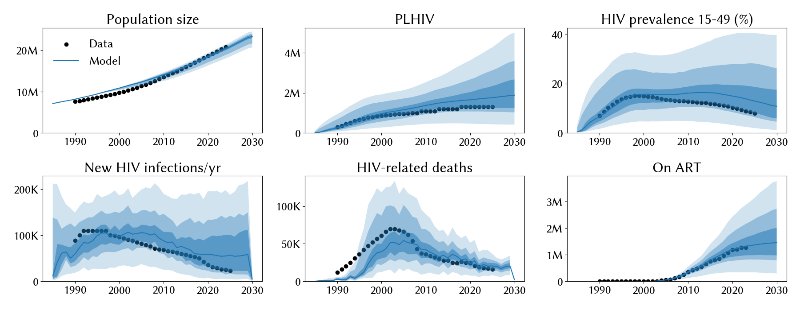
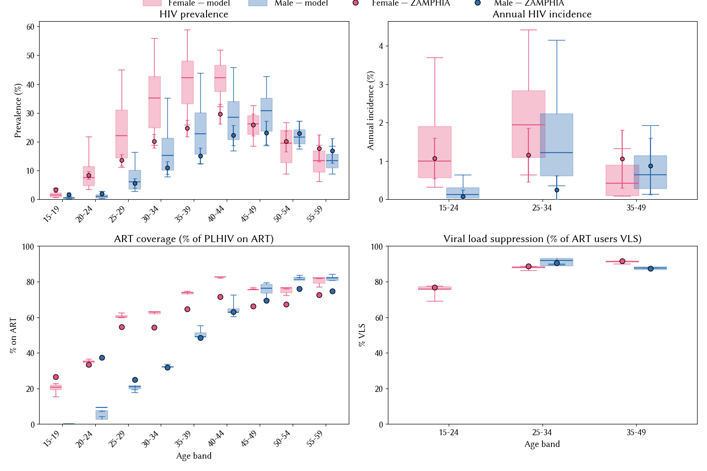

# Experiment 02.05 — 02.04 pars re-run on corrected prev 15-49 targets

**Date run:** 2026-09-28.
**Commit:** `4f845a3`.
**Trials / workers:** 1000 / 50. **Ensemble size after shrink:** 500 draws.
**Sustainability:** 0/500 extinct at 2030 (min prev 15-49 = 0.8% at 2030).
**Mismatch:** min=12.61, mean=21.93, max=30.68.

## Question

Does 02.04's posterior structure hold on the corrected UNAIDS prev
series (peak higher mid-1990s / mid-2000s, endpoints lower)? And does
`hiv.eff_condom` still pin upper?

## Result

**Mismatch essentially unchanged from 02.04 (12.6 vs 12.7); condom
signal strengthened; posterior found a different corner with same
fit quality.** `hiv.eff_condom` posterior mean pushed slightly higher
(0.88 vs 0.85 in 02.04) — the corrected data pulls even harder on the
condom lever. Fit metrics almost identical (54k new infections median,
same as 02.04). But the network posterior structure shifted
substantially: `prop_f0` dropped from 0.85 → 0.67, `p_pair_form`
climbed from 0.47 → 0.63, `m2_conc` from 0.49 → 0.67. Multi-modal
likelihood surface — same fit reachable through different network
configurations.

## Fit at 2023 (median, 10-90%)

| Metric | Data (new) | Exp 02.04 | Exp 02.05 | Notes |
|---|---|---|---|---|
| Population | 20.3 M | 20.0 M | 19.9 M [18.4 – 20.5] | same |
| PLHIV | 1.30 M | 1.64 M | 1.73 M [1.07 – 2.96] | slightly higher |
| New infections/yr | 23 k | 54 k | 54 k [19 – 142] | same overshoot |
| HIV deaths/yr | 17 k | 20 k | 22 k [14 – 32] | slightly hotter |
| On ART | 1.27 M | 1.25 M | 1.32 M [0.82 – 2.16] | ~matches |
| Prev 15-49 | 8.9 % | 13.3 % | 13.8 % [7.2 – 28.1] | ~same overshoot vs new target |

## Posterior parameters (mean, 5-95%)

| Parameter | Prior | Exp 02.04 | Exp 02.05 | Note |
|---|---|---|---|---|
| `hiv.beta_m2f` | [0.008, 0.20] | 0.0244 | 0.0248 (0.0168-0.0338) | stable |
| `hiv.rel_death` | [0.6, 1.6] | 1.225 | 1.304 (1.079-1.523) | up; tighter CI |
| `hiv.eff_condom` | [0.5, 0.9] | 0.854 | 0.882 (0.837-0.900) | **pins upper harder** |
| `structuredsexual.prop_f0` | [0.55, 0.9] | 0.846 | 0.671 (0.625-0.815) | **dropped substantially** |
| `structuredsexual.prop_m0` | [0.60, 0.80] | 0.774 | 0.742 | slight down |
| `structuredsexual.prop_f2` | [0.005, 0.05] | 0.0345 | 0.0373 (0.022-0.045) | ~same, near upper |
| `structuredsexual.prop_m2` | [0.005, 0.05] | 0.0285 | 0.0193 (0.013-0.037) | dropped |
| `structuredsexual.f1_conc` | [0.01, 0.2] | 0.104 | 0.061 | dropped |
| `structuredsexual.m1_conc` | [0.01, 0.2] | 0.145 | 0.139 | stable |
| `structuredsexual.f2_conc` | [0.05, 0.5] | 0.194 | 0.178 (0.10-0.30) | ~same |
| `structuredsexual.m2_conc` | [0.2, 0.8] | 0.494 | 0.669 (0.40-0.80) | **UP substantially** |
| `structuredsexual.p_pair_form` | [0.4, 0.9] | 0.472 | 0.633 (0.576-0.719) | **UP substantially** |

## Observations

1. **`eff_condom` pins harder against upper 0.9** (mean 0.88, 90% CI
   0.84-0.90) on the corrected data. Reinforces the biology-consistent
   signal that condoms need to be more effective than 0.5. **A
   `rel_condom_use` lever added on top would probably also pin
   upper** — condoms are being asked to do as much cooling as the
   parameter space allows.
2. **Multi-modal posterior.** Same mismatch (12.6 vs 12.7), same
   incidence overshoot (54 k), but very different network
   configuration. 02.04 favored `prop_f0` 0.85 + `p_pair_form` 0.47;
   02.05 landed at `prop_f0` 0.67 + `p_pair_form` 0.63. Both configs
   produce equivalent aggregate outputs. Suggests parameter identifiability
   is a concern — the network pars are trading off with each other.
3. **Prev 15-49 overshoot is larger relative to the corrected data**
   than it was against the pre-refresh data. Model median 13.8% vs
   data 8.9% is a 4.9pp gap (was 3.5pp against pre-refresh 9.8%).
   The corrected series tightens the target and the fit doesn't reach
   it.
4. **Extinction margin narrowed.** Min prev at 2030 is 0.8% (was 1.2%
   in 02.04). A slice of the ensemble is dangerously close to
   burn-out. Worth watching if we add more cooling knobs.

## Next-step candidate

- **Open `structuredsexual.rel_condom_use`** (upstream 3-line stisim
  change + reopen calibration). The condom signal is real and getting
  stronger; a scale on the condom coverage data itself is defensible
  and orthogonal to `eff_condom` (coverage vs efficacy). Would likely
  cool prev further toward the corrected 8.9% target.
- Consider the **multi-modality**: run the same experiment again with
  a different seed / more trials to see if posteriors are truly
  bimodal or Optuna is just finding local basins.
- Accept the current fit and start scenario design; ~13.8% vs 8.9%
  prev is imperfect but the incidence and death matches are reasonable.
