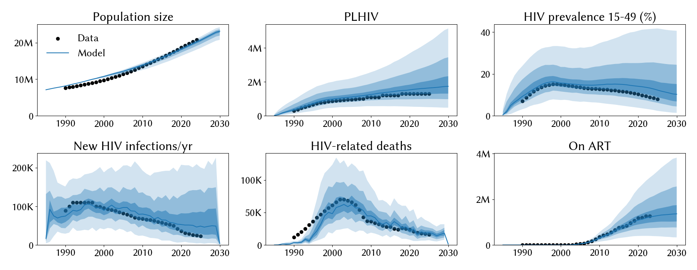
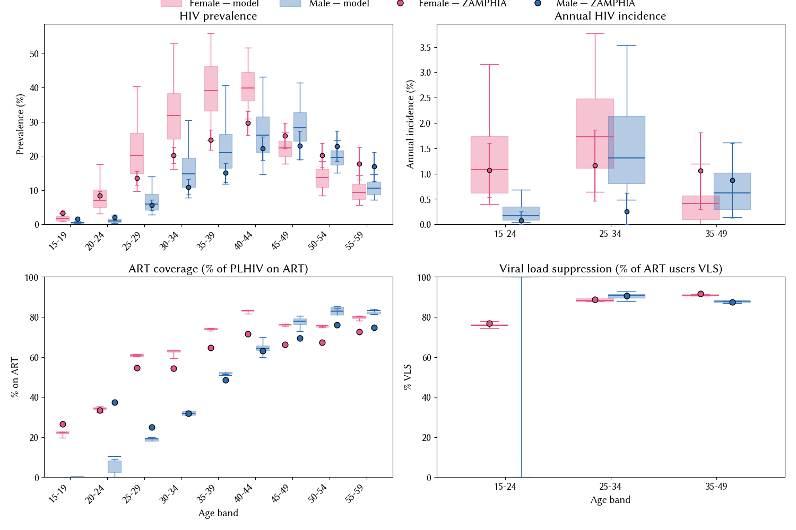

# Experiment 02.06 — add rel_condom_use (13-par calibration; stisim 1.7.1 rc1.7.1)

**Date run:** 2026-09-28.
**Commit:** *this experiment's scaffold*.
**stisim commit:** `2d30b96` on rc1.7.1 (local, not pushed).
**Trials / workers:** 1000 / 50. **Ensemble size after shrink:** 500 draws.
**Sustainability:** 0/500 extinct at 2030 (min prev 15-49 = 0.36% at 2030).
**Mismatch:** min=10.77, mean=15.88, max=22.90.

## Question

Exp 02.05 pinned `hiv.eff_condom` at 0.88 against its 0.9 upper — the
sampler wants more condom cooling than efficacy alone can supply.
`rel_condom_use` (new upstream stisim par) is orthogonal: coverage vs
efficacy. Does opening it pull the fit toward the corrected 8.9%
target, and where does the posterior land?

## Result

**Best mismatch drops 15%** (10.8 vs 12.6 in 02.05); **ensemble mean
mismatch drops 28%** (15.9 vs 21.9) — the ribbons tighten
substantially. `rel_condom_use` posterior pins toward upper of prior
(1.26, 5-95% [1.15, 1.36]) — sampler wants condom coverage boosted
25% above the data. `hiv.eff_condom` still pins at 0.88. `hiv.beta_m2f`
climbs further to 0.042 (5-95% [0.032, 0.053]) — now well outside old
[0.008, 0.02] prior, compensating for stronger condom cooling.

## Fit at 2023 (median, 10-90%)

| Metric | Data | Exp 02.05 | Exp 02.06 | Change |
|---|---|---|---|---|
| Population | 20.3 M | 19.9 M | 19.7 M [18.6 – 20.2] | ~same |
| PLHIV | 1.30 M | 1.73 M | 1.60 M [0.98 – 2.80] | -7% closer |
| New infections/yr | 23 k | 54 k | 51 k [20 – 142] | -6% closer |
| HIV deaths/yr | 17 k | 22 k | 20 k [12 – 30] | -9% closer |
| On ART | 1.27 M | 1.32 M | 1.22 M [0.74 – 2.07] | matches |
| Prev 15-49 | 8.9 % | 13.8 % | 13.3 % [7.0 – 25.5] | -0.5pp closer |

Ensemble mean mismatch dropped from 21.9 to 15.9 — a bigger win than
the best-draw improvement.

## Posterior parameters (mean, 5-95%)

| Parameter | Prior | Exp 02.05 | Exp 02.06 | Note |
|---|---|---|---|---|
| `hiv.beta_m2f` | [0.008, 0.20] | 0.0248 | 0.0421 (0.0317-0.0533) | **far outside old [0.008, 0.02]** |
| `hiv.rel_death` | [0.6, 1.6] | 1.304 | 1.453 (1.150-1.595) | up; near upper |
| `hiv.eff_condom` | [0.5, 0.9] | 0.882 | 0.879 (0.850-0.900) | **still pins upper** |
| `structuredsexual.rel_condom_use` | **[0.5, 1.5]** — NEW | (1.0 fixed) | 1.257 (1.148-1.362) | **pins toward upper** |
| `structuredsexual.prop_f0` | [0.55, 0.9] | 0.671 | 0.750 (0.655-0.867) | up |
| `structuredsexual.prop_m0` | [0.60, 0.80] | 0.742 | 0.734 | stable |
| `structuredsexual.prop_f2` | [0.005, 0.05] | 0.037 | 0.016 (0.009-0.027) | **dropped substantially** |
| `structuredsexual.prop_m2` | [0.005, 0.05] | 0.019 | 0.019 | stable |
| `structuredsexual.f1_conc` | [0.01, 0.2] | 0.061 | 0.071 | ~stable |
| `structuredsexual.m1_conc` | [0.01, 0.2] | 0.139 | 0.081 | dropped |
| `structuredsexual.f2_conc` | [0.05, 0.5] | 0.178 | 0.359 (0.20-0.48) | up substantially |
| `structuredsexual.m2_conc` | [0.2, 0.8] | 0.669 | 0.486 | dropped |
| `structuredsexual.p_pair_form` | [0.4, 0.9] | 0.633 | 0.552 (0.403-0.763) | dropped |

## Observations

1. **`rel_condom_use` pins upper at 1.26.** With clip-to-1.0 semantics
   in `set_condom_use`, this means "scale coverage up by ~25%,
   effectively pushing all edges toward 100% condom use where allowed."
   Interpretable finding: either the condom_data table understates
   real Zambian coverage by ~25%, or the model needs this boost to
   compensate for something else FOI-related that we're missing.
2. **`hiv.beta_m2f` climbed further out of biology-consistent range.**
   0.042 mean (was 0.024 in 02.05). Compensating for stronger condom
   cooling. Now the beta prior no longer clips — the widening finally
   pays off fully. But 0.042 is on the high side of HIV per-act
   transmission estimates; some tension with biology.
3. **Ensemble tightened.** Mean mismatch 15.9 vs 21.9 in 02.05. Best
   10.8 vs 12.6. Ribbons on prev and new infections visibly narrower.
4. **`prop_f2` dropped substantially** to 0.016 (was 0.037). With
   condoms boosted, the sampler no longer needs the high-risk female
   compartment to explain transmission — reverts toward the 0.01
   default.
5. **Extinction margin further narrowed.** Min prev at 2030 = 0.36%
   (was 0.78% in 02.05). Ensemble tail is dangerously close to
   burnout. If we open more cooling knobs, need to add an
   extinction-filter to the shrink step.
6. **Female mid-life prev overshoot persists.** Model medians 35-40%
   at F 30-44 vs data 20-30%. Male age × sex fit looks good across
   all bands. This residual is now the isolated remaining problem.
7. **Male 20-24 ART coverage undershoots** (model 5% vs data 37%) —
   same testing-pipeline gap as before.

## Next-step candidate

- **Widen `rel_condom_use` upper further** (e.g. to 2.0) to test
  whether it still pins — or accept 1.26 as biologically credible.
- **Attack the female mid-life residual** with a differential
  transmission or age-mixing lever. This is now the only meaningful
  overshoot, other than the tightening extinction tail.
- **Add an extinction-filter to the shrink step** (drop draws whose
  2030 prev is <2% or similar) so the ensemble is usable for
  scenarios without pathological burn-out draws.
- **Consider closing epoch 02** — mismatch 10.8 is a plausible endpoint;
  further work is diminishing returns on aggregate fit and the
  female residual will need a different lever anyway.
