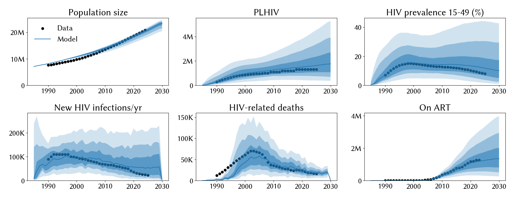
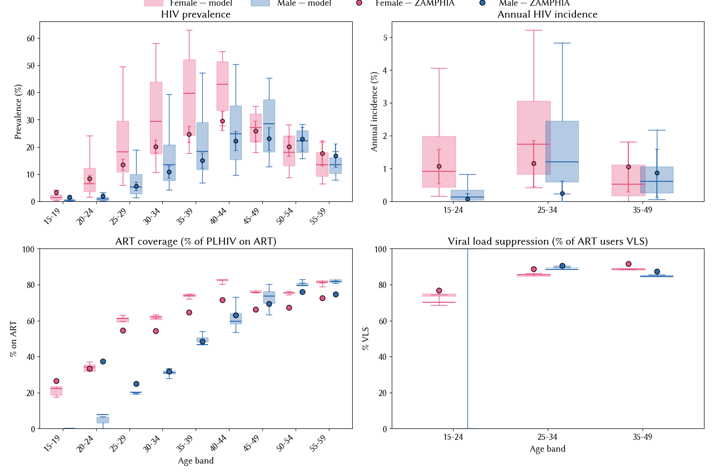

# Experiment 02.07 — time-varying VLS trajectory + widened eff_condom upper

**Date run:** 2026-09-28.
**Commit:** *this experiment's scaffold*.
**Trials / workers:** 1000 / 50. **Ensemble size after shrink:** 500 draws.
**Sustainability:** 0/500 extinct at 2030 (min prev 15-49 = 0.27% at 2030).
**Mismatch:** min=10.72, mean=18.61, max=28.76.

## Question

Exp 02.06 hit best mismatch 10.8 but 2020-2025 new infections declined
too slowly (50 k model vs 26 k data at 2023). Researcher's diagnosis:
model's per-agent ART efficacy is time-invariant at ZAMPHIA-2016
rates, missing the DTG-era improvement. Time-varying `vls_coverage`
trajectory should cool 2020-2025 without new calibration parameters.
Also widen `hiv.eff_condom` upper 0.9 → 0.95 since exp 02.06 pinned
it at 0.88.

## Result

**Sampler shuffled its posterior significantly but aggregate fit is
essentially the same as 02.06.** Best mismatch marginally lower (10.72
vs 10.77); ensemble mean mismatch slightly higher (18.6 vs 15.9).
`hiv.eff_condom` posterior **dropped off the upper bound** (0.83 vs
0.88 in 02.06) — the time-varying VLS took over some of the cooling
load, letting condom efficacy sit in a more moderate range.
`rel_condom_use` moved higher to 1.41. `beta_m2f` dropped from 0.042
to 0.031, more biologically reasonable.

**But 2020-2025 infection cooling didn't materialize much.** Model
2023 median new infections still 55 k vs data 26 k. The VLS
trajectory helped shift where the model puts cooling load (VLS now,
condom less) but didn't visibly speed up the 2020-2025 decline.

## Fit at 2023 (median, 10-90%)

| Metric | Data | Exp 02.06 | Exp 02.07 | Change |
|---|---|---|---|---|
| Population | 20.3 M | 19.7 M | 19.9 M [18.3 – 20.6] | ~same |
| PLHIV | 1.30 M | 1.60 M | 1.58 M [0.77 – 3.17] | ~same |
| New infections/yr | 23 k | 51 k | 55 k [14 – 151] | slightly worse |
| HIV deaths/yr | 17 k | 20 k | 20 k [11 – 32] | same |
| On ART | 1.27 M | 1.22 M | 1.19 M [0.57 – 2.32] | matches |
| Prev 15-49 | 8.9 % | 13.3 % | 12.7 % [4.4 – 30.3] | -0.6pp closer |

## Posterior parameters (mean, 5-95%)

| Parameter | Prior | Exp 02.06 | Exp 02.07 | Note |
|---|---|---|---|---|
| `hiv.beta_m2f` | [0.008, 0.20] | 0.0421 | 0.0313 (0.0186-0.0437) | dropped, more biological |
| `hiv.rel_death` | [0.6, 1.6] | 1.453 | 1.269 (0.954-1.525) | dropped |
| `hiv.eff_condom` | **[0.5, 0.95]** (was [0.5, 0.9]) | 0.879 | 0.828 (0.716-0.894) | **no longer pins upper** |
| `structuredsexual.prop_f0` | [0.55, 0.9] | 0.750 | 0.634 (0.566-0.808) | dropped |
| `structuredsexual.prop_m0` | [0.60, 0.80] | 0.734 | 0.687 (0.622-0.782) | dropped |
| `structuredsexual.prop_f2` | [0.005, 0.05] | 0.016 | 0.0394 (0.025-0.049) | up substantially |
| `structuredsexual.prop_m2` | [0.005, 0.05] | 0.019 | 0.0374 (0.015-0.048) | up substantially |
| `structuredsexual.f1_conc` | [0.01, 0.2] | 0.071 | 0.071 | stable |
| `structuredsexual.m1_conc` | [0.01, 0.2] | 0.081 | 0.053 | dropped |
| `structuredsexual.f2_conc` | [0.05, 0.5] | 0.359 | 0.157 (0.085-0.293) | dropped substantially |
| `structuredsexual.m2_conc` | [0.2, 0.8] | 0.486 | 0.624 (0.238-0.775) | up |
| `structuredsexual.p_pair_form` | [0.4, 0.9] | 0.552 | 0.712 (0.498-0.823) | up |
| `structuredsexual.rel_condom_use` | [0.5, 1.5] | 1.257 | 1.407 (1.297-1.494) | pins upper harder |

## Observations

1. **`eff_condom` no longer pins upper** — 0.83 (5-95% [0.72, 0.89])
   inside the widened [0.5, 0.95] prior. Time-varying VLS did what
   we hoped: it took over some cooling load so `eff_condom` didn't
   need to work as hard. Widening the prior didn't attract the
   posterior higher.
2. **`beta_m2f` dropped from 0.042 to 0.031** — closer to biological
   plausibility. More cooling from ART efficacy = less compensation
   from beta.
3. **2020-2025 infection curve didn't steepen materially.** Model 55 k
   at 2023 vs 51 k in 02.06 (roughly same); data is 26 k. The
   time-varying VLS trajectory shifted 2020 values from 77-92%
   (constant at ZAMPHIA 2016) to 79-94% (small increase) — probably
   too small a change to visibly cool aggregate FOI.
4. **`prop_f2` and `prop_m2` moved back toward upper.** Sampler wants
   more high-risk agents again — perhaps because the VLS-cooled ART
   pool means concurrent partnerships in the high-risk tier drive
   even more transmission per agent.
5. **Extinction margin further narrowed** — min prev at 2030 = 0.27%
   (was 0.36% in 02.06, 0.78% in 02.05, 1.17% in 02.04). Each
   experiment brings some draws closer to extinction. If we keep
   opening cooling knobs, we need a shrink-time extinction filter.
6. **Ensemble mean mismatch is HIGHER** (18.6 vs 15.9 in 02.06) — the
   widened `eff_condom` prior + shuffled posteriors slightly widened
   the ribbons.

## Next-step candidate

- **Larger VLS trajectory swing**: try a more aggressive change —
  e.g. 2020+ VLS in the mid-90s%, 2000 in the 30-40% range. The
  current trajectory (small change vs 2016) didn't move the fit
  meaningfully.
- **Time-varying `nonsupp_art_efficacy`**: adds a second lever for
  ART efficacy over time. Non-VLS ART blocks 35% of transmission by
  default; ramping to 60-70% by 2020 would cool the leaky-ART
  fraction. Would need a small stisim change (like `dur_on_art_trend`).
- **Add an extinction filter to the shrink step** — 500 draws include
  some near-burnout runs. Filter min prev at 2030 > 2% before
  shrinking.
- **Consider closing epoch 02** — mismatch 10.7 is a plausible
  endpoint. Female mid-life residual, 2020-2025 flatness, and
  extinction tail all suggest diminishing returns on aggregate fit
  from further parameter tweaks.
