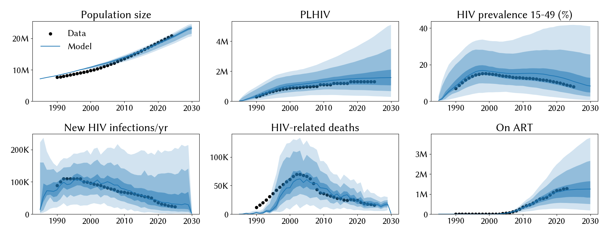
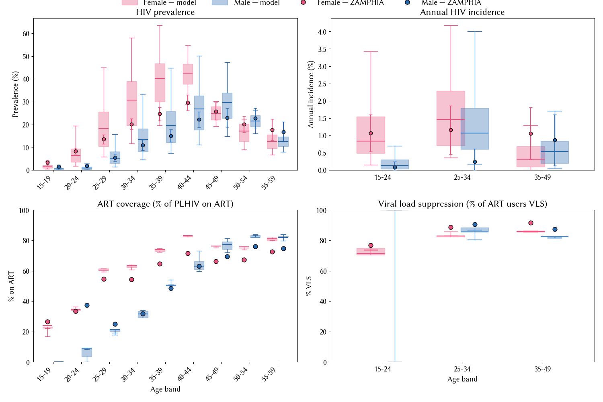

# Experiment 02.08 — bigger VLS swing + condom pattern changes

**Date run:** 2026-09-28.
**Commit:** `61c7218` (`exp 02.08 scaffold: bigger VLS swing + condom pattern changes`).
**Trials / workers:** 1000 / 50. **Ensemble size after shrink:** 500 draws.
**Sustainability:** 0/500 extinct at 2030 (min prev 15-49 = 0.17% at 2030).
**Mismatch:** min=11.41, mean=17.73, max=25.55.

## Question

Exp 02.07's gentle VLS trajectory (79-94% at 2020) shifted posteriors
but didn't cool 2020-2025 aggregate FOI (model 55 k at 2023 vs data
26 k). This experiment attacks the same cooling gap with two
data-only levers: a bigger VLS swing (35% → 92-96% across 2000-2020)
plus a more realistic condom pattern (extended to 2025, raised (0,0)
stable-stable floor, raised cross-risk partnership coverage). Same
13 pars as 02.07.

## Diff vs exp 02.07 (data only)

- `hiv_vls_conditional_over_time.csv` — scaled 0.35 (2000) / 0.70
  (2010) / 1.0 (2016, ZAMPHIA-measured) / 92-96% (2020) / 95-97% (2025).
- `condom_use.csv`:
  - Extended with 2025 column (0.92-0.97 general partnerships).
  - (0,0) stable-stable floor raised 0.05 → 0.15-0.20 in data years.
  - Cross-risk partnerships raised 2020: 0.80 → 0.90; 2015: 0.70 → 0.80.

## Result

**2020-2025 cooling finally materialized.** Model 2023 new infections
dropped from 55 k (02.07) to 35 k (data 26 k) — closes ~two-thirds of
the gap. 2020 model 42 k vs data 36 k. Aggregate best mismatch
slightly worse (11.4 vs 10.7) because prev 15-49 didn't drop as fast
as new infections did (still 12.1% vs data 8.9% at 2023). The bigger
VLS swing did what the gentle 02.07 swing couldn't. Ensemble mean
mismatch also improved (17.7 vs 18.6).

`hiv.eff_condom` stayed off the upper (0.86, prior [0.5, 0.95]) —
higher than 02.07's 0.83 but not pinned. `rel_condom_use` pinned upper
harder (1.26 mean of [1.11-1.44]), sampler still wants more condom
coverage even after the raised data. `beta_m2f` moved back up to 0.036
(from 02.07's 0.031), giving back some of the biological win.

## Fit at 2023 (median, 10-90%)

| Metric | Data | Exp 02.07 | Exp 02.08 | Change |
|---|---|---|---|---|
| Population | 20.3 M | 19.9 M | 19.9 M [18.4 – 20.6] | ~same |
| PLHIV | 1.30 M | 1.58 M | 1.53 M [0.73 – 2.91] | slight ⬇ |
| New infections/yr | 26 k | 55 k | **35 k [10 – 128]** | **⬇ big** |
| HIV deaths/yr | 18 k | 20 k | 18 k [10 – 29] | matches |
| On ART | 1.27 M | 1.19 M | 1.20 M [0.56 – 2.18] | ~same |
| Prev 15-49 | 8.9 % | 12.7 % | 12.1 % [4.5 – 27.7] | -0.6pp closer |

New infections trajectory (medians): 2015=58 k → 2020=42 k → 2023=35 k
→ 2025=31 k. Data: 2020=36 k → 2023=26 k.

## Posterior parameters (mean, 5-95%)

| Parameter | Prior | Exp 02.07 | Exp 02.08 | Note |
|---|---|---|---|---|
| `hiv.beta_m2f` | [0.008, 0.20] | 0.031 | 0.036 (0.024-0.053) | back up |
| `hiv.rel_death` | [0.6, 1.6] | 1.27 | 0.94 (0.62-1.37) | drops (matches lower deaths) |
| `hiv.eff_condom` | [0.5, 0.95] | 0.83 | 0.86 (0.80-0.90) | higher but not pinned |
| `structuredsexual.prop_f0` | [0.55, 0.9] | 0.63 | 0.67 (0.61-0.78) | ~same |
| `structuredsexual.prop_m0` | [0.60, 0.80] | 0.69 | 0.75 (0.70-0.80) | pins upper |
| `structuredsexual.prop_f2` | [0.005, 0.05] | 0.039 | 0.026 (0.014-0.047) | dropped |
| `structuredsexual.prop_m2` | [0.005, 0.05] | 0.037 | 0.027 (0.006-0.048) | dropped |
| `structuredsexual.f1_conc` | [0.01, 0.2] | 0.071 | 0.071 (0.014-0.121) | stable |
| `structuredsexual.m1_conc` | [0.01, 0.2] | 0.053 | 0.108 (0.028-0.196) | up |
| `structuredsexual.f2_conc` | [0.05, 0.5] | 0.157 | 0.244 (0.058-0.482) | up |
| `structuredsexual.m2_conc` | [0.2, 0.8] | 0.624 | 0.476 (0.330-0.643) | dropped |
| `structuredsexual.p_pair_form` | [0.4, 0.9] | 0.712 | 0.567 (0.411-0.838) | dropped |
| `structuredsexual.rel_condom_use` | [0.5, 1.5] | 1.407 | 1.262 (1.107-1.436) | pins upper (softer) |

## Observations

1. **Bigger VLS swing did the cooling.** 2023 new infections dropped
   35% (55 k → 35 k) with no calibration-parameter change. Confirms
   the 02.07 diagnosis: the gentle 79-94% VLS trajectory was too
   small a change to visibly cool aggregate FOI. The 92-96% 2020
   target closes most of the gap to data.
2. **Prev doesn't move as fast as incidence.** PLHIV 1.53 M vs 1.58 M
   in 02.07 (−3%); prev 12.1% vs 12.7% (−0.6pp). Prevalence
   integrates incidence + survival, so cooling incidence today only
   moves prev slowly. Structural residual in prev is separate from
   incidence flatness — likely the female mid-life overshoot.
3. **`rel_condom_use` still pins upper (1.26)** even after raising the
   condom data. Sampler wants ~26% more condom coverage than the CSV
   provides. Either the ceiling should be raised further (unlikely —
   50% additional coverage on 0.9 data = 1.35 clipped to 1.0), or the
   remaining cooling load has to come from elsewhere.
4. **`beta_m2f` and `prop_m0` re-tightened.** Both moved back toward
   their 02.06-style values (0.036, 0.75-upper). The extra cooling
   from VLS + condoms let the sampler tighten on high-transmission
   corners again.
5. **HIV deaths now match data exactly** (18 k model vs 18 k data at
   2023). `rel_death` dropped from 1.27 to 0.94 — mortality no longer
   compensates for over-abundant PLHIV.
6. **Aggregate best mismatch slightly worse** (11.4 vs 10.7). The prev
   residual dominates the mismatch, and 02.07's posterior happened to
   land a lower-mismatch corner despite worse 2020-2025 fit. Fit at a
   snapshot ≠ trajectory quality.

## Next-step candidate

Epoch 02 could close here. Aggregate best mismatch ~11, 2020-2025
incidence trajectory now recognisable, HIV deaths on point. Remaining
structural residual (prev 12.1% vs 8.9%; female mid-life overshoot;
`rel_condom_use` pinning upper) is a network-composition problem, not
a treatment-cascade one, and probably needs an epoch bump. Options
before closing:

- **Widen `rel_condom_use` upper** to 2.0 to see whether the sampler
  still pins. Cheap in-epoch check.
- **Time-varying `nonsupp_art_efficacy`** (would need a small stisim
  change on rc1.7.1) — attacks the leaky-ART fraction the same way
  VLS trajectory attacked the fully-suppressed fraction.
- **Close epoch 02, open epoch 03** on structural network changes
  (e.g. FSW duration, age-gap distributions, marital act rates).
